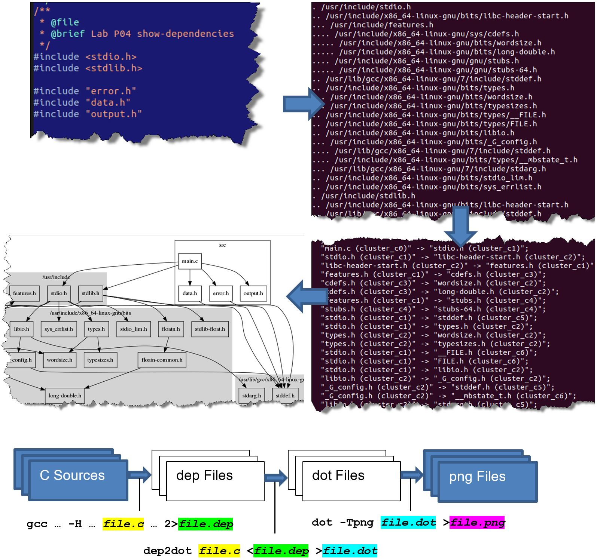
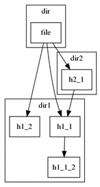
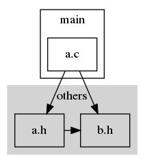

# 04 - Modularisieren von C Code



___

## 1. Übersicht 

In diesem Praktikum üben Sie modulare Programmierung indem Sie ein
Java Programm (bestehend aus drei Java Files) in ein entsprechendes C
Programm aus drei Modulen (aus je einem Header- und Implementations-
File) übersetzen. Sie passen das Makefile so an, dass die
entsprechenden Module mit kompiliert werden.

In der zweiten Aufgabe erstellen Sie Makefile Regeln für die drei
Schritte von den C Source Files zur graphischen Darstellung der
Abhängigkeiten.


Im Anhang ist eine Übersicht über die verwendeten File Formate gegeben.


## 2. Lernziele 

In diesem Praktikum lernen Sie die Handgriffe um ein Programm zu modularisieren, d.h. in mehrere Module aufzuteilen.

* Sie wissen, dass ein Modul aus einem C-File und einem passenden
  H-File besteht.
* Sie können Header Files korrekt strukturieren.
* Sie deklarieren im Header-File die öffentlichen Typen und Funktionen
  eines Moduls.
* Sie wissen wie **Include Guards** anzuwenden sind.
* Sie können Module im `Makefile` zur Kompilation hinzufügen.
* Sie können `Makefile` Regeln schreiben.
  
Die Bewertung dieses Praktikums ist am Ende angegeben.

Erweitern Sie die vorgegebenen Code Gerüste, welche im `git`
Repository `snp-lab-code` verfügbar sind.


## 3. Aufgabe 1: Modularisieren 
Das zu ergänzende Programm dep2dot hat folgende Funktionalität:

Ergänzen Sie in **`modularize/src`** den Code in **`triangle.c`**,
**`read.h`**, **`read.c`**, **`rectang.h`** und **`rectang.c`** so
dass die Tests erfolgreich durchlaufen. Die C Implementation soll
dieselbe Funktionalität haben wie die gegebenen Java Files. Lehnen Sie
sich so nahe wie möglich an die Java Files an.

1. In den Header-Files implementieren Sie den Include-Guard und
   deklarieren Sie die öffentlichen Funktionen und gegebenenfalls
   **`#define`**.
2. In den Implementations-Files implementieren Sie die Funktionen.

Die drei Java Files liegen in **`modularize/java`**.

### Tipps

* Implementieren Sie die Symbole welche vollständig in Grossbuchstaben
  geschrieben sind als **`#define`**.
* **`EOF`** kommt schon aus **`stdio.h`** und sollte deshalb nicht
  mehr definiert werden.
* Jene **`#define`** welche von andern Modulen verwendet werden
  kommen ins Header-File, die andern ins Implementations-File.
* Ein Grossteil des Java Codes aus den Methoden Bodies kann
  eins-zu-eins in C übernommen werden.  Listen Sie auf welche
  Unterschiede es gibt:

<table>
<style>
table, th, td {
  border: 1px solid black;
  border-collapse: collapse;
}
table th:first-of-type {
    width: 50%;
}
table th:nth-of-type(2) {
    width: 50%;
}
</style>
<tr><th>Java</th><th>C</th></tr>
<tr><td>

```Java
byte
```

</td><td>

```C
unsigned char
```

</td></tr>
<tr><td>

```Java
boolean
```

</td><td>

```C
#include <stdbool.h>
bool
```

</td></tr>
<tr><td>


```Java
true
```
</td><td>

```C
true
0
```

</td></tr>
<tr><td>

```Java
false
```

</td><td>

```C
false
1
```

</td></tr>
<tr><td>

```Java
System.out.print(…)
```

</td><td>

```C
printf(…)
```

</td></tr>
<tr><td>

```Java
System.out.println(…)
```

</td><td>

```C
printf(…);
putchar('\n');
```

</td></tr>
<tr><td>

```Java
System.in.read()
```


</td><td>

```C
getchar()
```

</td></tr>
<tr><td>

```Java
byte[] buffer = new byte[BUFFERSIZE];
```

</td><td>

```C
unsigned char buffer[BUFFERSIZE];
```

</td></tr>
<tr><td>

```Java
public class rectang {
    public boolean Rectangular(…)
    { … }
}
```

</td><td>

```C
#include <stdbool.h>
bool Rectangular(…) {
    { … }
}
```

</td></tr>
<tr><td>

```Java
public class read {
    public int getInt(...)
        throws java.io.IOException
    { ... }
}
```

</td><td>

```C
int getInt(…) {
    { … }
}
```

</td></tr>
<tr><td>

```Java
class triangle {
    public static void main(String[] args)
        throws java.io.IOException
    { ... }
}
```

</td><td>

```C
int main(void) {
    { … }
}
```

</td></tr>
<tr><td>

```Java
read ReadInt = new read();
...
word = ReadInt.getInt(MAX_NUMBER);
```

</td><td>

```C
int word = getInt(MAX_NUMBER);
```

</td></tr>
<tr><td>

```Java
rectang Rect = new rectang();
...
if (Rect.Rectangular(a, b, c) == true) { ... }
```

</td><td>

```C
bool result = Rectangular(a, b, c);
if (result) { … }
```

</td></tr>
<tr><td>

```
System.out.println(
"-> Dreieck " + a + "-" + b + "-" + c
+ " ist rechtwinklig");
```

</td><td>

```C
printf("-> Dreieck %d-%d-%d ist rechtwinklig\n", a, b, c);
```

</td></tr>
</table>

## 4. Aufgabe 2: Makefile Regeln

Die folgenden drei Schritte erstellen von einem C Source File eine
graphische Darstellung der Abhängigkeiten:

1. `gcc ... -H .. file.c ... 2> file.dep` (Regeln im Makefile bereits vorhanden)
2. `dep2dot file.c <file.dep >file.dot` (in dieser Aufgabe zu erstellen)
3. `dot -Tpng file.dot >file.png` (in dieser Aufgabe zu erstellen)

Sie sollen für die Compiler-ähnlichen Programme `dep2dot` und `dot`
Makefile Regeln schreiben.


Das Programm `dep2dot` hat folgende Funktionalität:


1. Es liest von `stdin` die vom Compiler generierten
   Abhängigkeits-Daten in Form des `dep` Formates ein.
2. Das erste und einzige Command Line Argument gibt das File an für
   welches die von `stdin` gelesenen Abhängigkeiten gelten.
3. Auf `stdout` werden die Abhängigkeiten von `stdin` übersetzt als
   `dot`-File Format ausgegeben.

Das Programm `dot` hat folgende Funktionalität:
1. Es liest die textuelle Beschreibung eines Graphen aus der
   übergebenen Datei (erstes Argument) ein.
2. Auf `stdout` wird die grafische Darstellung der Beschreibung der
   Eingabe-Datei im `png`-File Format ausgegeben.

Das `dep`-Format und das `dot`-Format sind im Anhang beschrieben.

Sie können die Funktionalität des Programms `dep2dot` kennen lernen,
indem Sie folgende Zeilen auf der Bash Shell ausführen. Das
`dep.input` File ist Teil der automatisierten Test Suite im
Verzeichnis `tests`:


```bash
bin/dep2dot dir/file <tests/dep.input >dep.dot
dot -Tpng dep.dot >dep.png
firefox dep.png
```

Als Resultat sollte Firefox folgende Graphik darstellen:





Definieren Sie im `Makefile` Regeln, welche die einzelnen Schritte von
den Source Files zu den `png` Files ausführen.


Prüfen Sie schliesslich die Umsetzung Aufgabe mittels `make dep-clean
dep && firefox ./src/*.png`


### 4.1 Neue Regeln hinzufügen


Führen Sie im `Makefile` an den angegebenen Stellen folgende
Ergänzungen durch

* definieren Sie eine Variable `DEPFILES` deren Inhalt die Liste alle
  Einträge der Variable `SOURCES` ist, wobei bei allen die Endung `.c`
  durch die Endung `.c.png` ersetzt ist
* fügen Sie zum `Pseudo-Target .PHONEY` das Target `dep` dazu – dies
  besagt, dass das später folgenden Target `dep` nicht ein File
  repräsentiert (ohne dieses Setting würde make gegebenenfalls nach
  einem File mit Namen `dep` suchen um zu entscheiden ob es
  inkrementell gebildet werden muss)
* schreiben Sie das Target `dep` gemäss der Beschreibung im Makefile
* schreiben Sie die Suffix Regel für die Übersetzung von `.png <-
  .dot` gemäss Vorgabe im `Makefile` (als Inspiration, siehe auch die
  `%.c.dep: %.c` Suffix Regel weiter unten im `Makefile`) – erklären
  Sie was die Regel macht
* schreiben Sie die Suffix Regel für die Übersetzung von` .dot <-
  .dep` gemäss Vorgabe im `Makefile` – erklären Sie was die Regel
  macht

Die Umsetzung der obigen Änderungen sind erfolgreich, wenn Sie
folgende Shell Command Line erfolgreich ausführen können und in
Firefox die Abhängigkeiten der C-Files von den Include Files
dargestellt wird.

`make dep-clean dep && firefox ./src/*.png`


### 4.2 Resultate analysieren und erklären

* Analysieren Sie die in der vorherigen Aufgabe erstellten grafischen Darstellungen.
* Erklären Sie was dargestellt wird und stellen Sie den Bezug zum zugehörigen C-Code her.

___
## 5. Bewertung 

Die gegebenenfalls gestellten Theorieaufgaben und der funktionierende Programmcode müssen der Praktikumsbetreuung gezeigt werden. Die Lösungen müssen mündlich erklärt werden.

| Aufgabe | Kriterium | Punkte |
| :-- | :-- | :-- |
| 1 | Sie können das funktionierende Programm inklusive funktionierende Tests demonstrieren und erklären. |  |
| 1 | Module einbinden, Header Files schreiben | 2 |
| 2 | Sie können das funktionierende Makefile demonstrieren und erklären. |  |
| 2 | Neue Regeln hinzufügen | 2 |


___

## 6. Anhang 

### 6.1	Verwendete zusätzliche Sprach Elemente


**Sprach Element**

```C
fprintf(stderr, "v=%d", v)
```

**Beschreibung**

Formatierte Ausgabe auf den Standard Error Stream. Siehe ***man 3
stderr*** und ***man 3 fprintf***.


### 6.2	Verarbeitung und verwendete File Formate <a name="file_formats"></a>

Das Programm in diesem Praktikum ist Teil für die graphische
Darstellung von `#include` File Abhängigkeit von C Files.

Den ersten Schritt für die Darstellung der `#include` File
Abhängigkeiten bietet der Compiler. Der Compiler kann mittels der `-H`
Command Line Option auf `stderr` ein Text File generieren, welches die
tatsächlich verwendeten Header Files auflistet. Zusätzlich wird im
Resultat die Verschachtelungstiefe der Includes angegeben.

Im zweiten Schritt übersetzt das Programm (`dep2dot`) dieses
Praktikums solche Dependency Files (`dep`) in eine Text Repräsentation
der Abhängigkeiten (`dot`) welche in graphische Darstel-lung (`png`)
übersetzt werden kann.

Als Tool zur Übersetzung der `dot` Files in das `png` Format dient das
`dot` Tool. Dieses Tool muss gegebenenfalls installiert werden:

```sudo apt install graphviz```

Die `png` Files können dann z.B. in der Programm Dokumentation
integriert werden (Darstellung zu Test Zwecken z.B. mittels `firefox
file.png`).


#### 6.2.1	dep File 


Siehe: `man gcc`

```bash
-H  Print the name of each header file used, in addition to other
    normal activities.  Each name is indented to show how deep in the
    #include stack it is. [...]
```

Das File wird auf `stderr` ausgegeben.

**Beispiel File** (für Abhängigkeiten des `main.c` Files des `dep2dot` Programms)

```bash
. /usr/include/stdio.h
.. /usr/include/x86_64-linux-gnu/bits/libc-header-start.h
... /usr/include/features.h
.... /usr/include/x86_64-linux-gnu/sys/cdefs.h
..... /usr/include/x86_64-linux-gnu/bits/wordsize.h
..... /usr/include/x86_64-linux-gnu/bits/long-double.h
.... /usr/include/x86_64-linux-gnu/gnu/stubs.h
..... /usr/include/x86_64-linux-gnu/gnu/stubs-64.h
.. /usr/lib/gcc/x86_64-linux-gnu/7/include/stddef.h
.. /usr/include/x86_64-linux-gnu/bits/types.h
... /usr/include/x86_64-linux-gnu/bits/wordsize.h
... /usr/include/x86_64-linux-gnu/bits/typesizes.h
.. /usr/include/x86_64-linux-gnu/bits/types/__FILE.h
.. /usr/include/x86_64-linux-gnu/bits/types/FILE.h
.. /usr/include/x86_64-linux-gnu/bits/libio.h
... /usr/include/x86_64-linux-gnu/bits/_G_config.h
.... /usr/lib/gcc/x86_64-linux-gnu/7/include/stddef.h
.... /usr/include/x86_64-linux-gnu/bits/types/__mbstate_t.h
... /usr/lib/gcc/x86_64-linux-gnu/7/include/stdarg.h
.. /usr/include/x86_64-linux-gnu/bits/stdio_lim.h
.. /usr/include/x86_64-linux-gnu/bits/sys_errlist.h
. /usr/include/stdlib.h
.. /usr/include/x86_64-linux-gnu/bits/libc-header-start.h
.. /usr/lib/gcc/x86_64-linux-gnu/7/include/stddef.h
.. /usr/include/x86_64-linux-gnu/bits/floatn.h
... /usr/include/x86_64-linux-gnu/bits/floatn-common.h
.... /usr/include/x86_64-linux-gnu/bits/long-double.h
.. /usr/include/x86_64-linux-gnu/bits/stdlib-float.h
. src/error.h
.. /usr/lib/gcc/x86_64-linux-gnu/7/include/stddef.h
. src/data.h
.. /usr/lib/gcc/x86_64-linux-gnu/7/include/stddef.h
. src/output.h
Multiple include guards may be useful for:
/usr/include/x86_64-linux-gnu/bits/stdlib-float.h
/usr/include/x86_64-linux-gnu/bits/sys_errlist.h
/usr/include/x86_64-linux-gnu/bits/typesizes.h
/usr/include/x86_64-linux-gnu/gnu/stubs-64.h
/usr/include/x86_64-linux-gnu/gnu/stubs.h
```


#### 6.2.2	dot File 

**Graphviz** ist ein mächtiges Tool-Set welches Graphen, definiert in
einem `dot`-Text File, automatisch anordnet und in `png`, `gif` und
andere Formate übersetzt.

Siehe die offizielle Web-Page
[https://www.graphviz.org/](https://www.graphviz.org/).

Es gibt als Teil dieses Tool-Sets verschiedene Übersetzer. Der hier
verwendete ist der Basis-übersetzer: `dot`.

Das `dot`-File Format kennt viele Möglichkeiten die Knoten und Kanten
eines Graphen und deren Anordnung anzugeben.

Der Vorteil eines solchen Tool-Sets ist, dass man den Inhalt (den
Graphen) einfach definieren kann und sich nicht um das komplexe
Problem der ansprechenden Visualisierung kümmern muss.

**Beispiel File** (`dot -Tpng sample.dot > sample.png`)

```C
digraph G {
   node [shape=box]
   A [label="a.c"];
   B [label="a.h"];
   C [label="b.h"];

   subgraph cluster_c0 {
      label="main"; color=black;
      A;
   }

   subgraph cluster_c1 {
      label="others"; style=filled; color=lightgrey;
      { B; C; rank=same; }
   }

   A -> B;
   A -> C;
   B -> C;
}
```




#### 6.2.3	png File

Das `png` Format ist ein verlustfrei komprimiertes Raster Graphik
Format. Es wird oft in Web Pages verwendet.


___
Version: 22.02.2022
